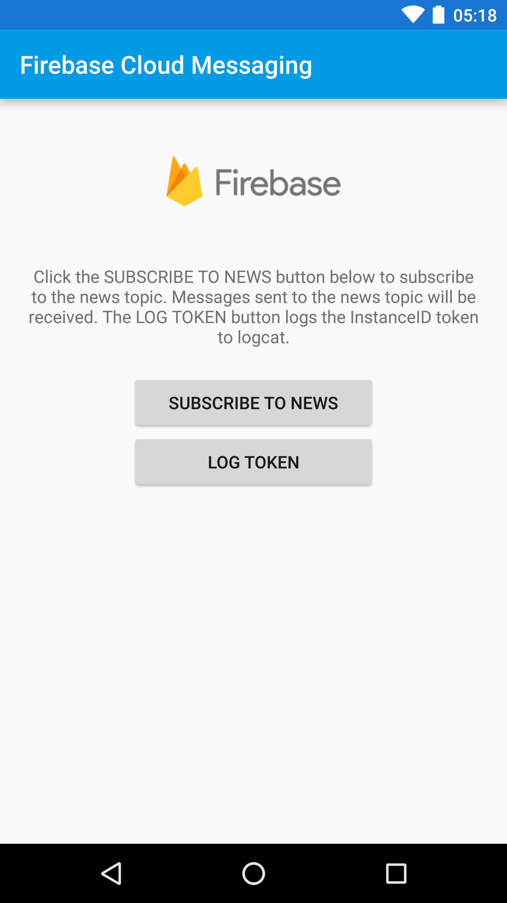

**** Changes 
1) Change package name to "org.sunnycorp.sunnypn" to work with my Firebase notfication project;
2) Add click_action handling for both background and foreground so that it can launch activity other than the default launcher. 

**** Click Action
I am able to send push notifications through both Firebase or AWS SNS. To send through Firebase, if you need to click_action, you can add a key/value pair as "click_action/org.sunnycorp.sunnypn.Main2Activity". To send through SNS, I cannot figure out why click_action does not work; the best I can reach now is by sending JSON content as 

```
{
"GCM": "{ \"notification\": { \"title\": \"Sunny Message\",\"text\": \"test message\",\"sound\":\"default\"} }"
}
```
Also got to set TTL time to some positive value say 8. Another note is that the GCM API key can be found as instructed here as [Firebase Server Key](https://stackoverflow.com/questions/38300450/fcm-with-aws-sns). 

**** References 
* How to show custom layout for remote push notificsation, see [StackOverflow](https://stackoverflow.com/questions/36945702/how-to-show-custom-ui-for-a-gcm-push-notification)
* [Android Notification API Guide](https://developer.android.com/guide/topics/ui/notifiers/notifications.html)
* [Getting Started With Push Notifications on Android](https://github.com/hathibelagal/GCM-Push-Notifications)
* [Firebase Cloud Messaging](https://firebase.google.com/docs/cloud-messaging/)
* [Amazon Simple Notification Service (SNS)](https://aws.amazon.com/sns/)

Firebase Cloud Messaging Quickstart
==============================

The Firebase Cloud Messaging Android Quickstart app demonstrates registering
an Android app for notifications and handling the receipt of a message.
**InstanceID** allows easy registration while **FirebaseMessagingService** and **FirebaseInstanceIDService**
enable token refreshes and message handling on the client.

Introduction
------------

- [Read more about Firebase Cloud Messaging](https://firebase.google.com/docs/cloud-messaging)

Getting Started
---------------

- [Add Firebase to your Android Project](https://firebase.google.com/docs/android/setup).
- Run the sample on Android device or emulator.

Sending Notifications
---------------------

Use Firebase console to send FCM messages to device or emulator.

## Send to a single device

- From Firebase console Notification section, click **New Message**.
- Enter the text of your message in the Message Text field.
- Set the target to **Single Device**.
- Check the logs for the **InstanceID** token, copy and paste it into the Firebase console Token field.
  - If you cannot find the token in your logs, click on the **LOG TOKEN** button in the application and the token will
  be logged in **logcat**.
- Click on the **Send Message** button.
- If your application is in the foreground you should see the incoming
  message printed in the logs. If it is in the background, a system notification should be
  displayed. When the notification is tapped, the application should return to the quickstart application.

## Send to a topic

- From Firebase console Notification section, click **New Message**.
- Enter the text of your message in the Message Text field.
- Click on the **SUBSCRIBE TO NEWS** button to subscribe to the news topic.
- Set the target to **Topic**.
- Select the news topic from the list of topics ("news" in this sample). 
  You must subscribe from the device or emulator before the topic will will be visible in the console.
- Click on the **Send Message** button.
- If your application is in the foreground you should see the incoming
  message printed in the logs. If it is in the background, a system notification should be
  displayed. When the notification is tapped, the application should return to the quickstart application.

Best Practices
--------------

## Android notification channels

### Set default channel

If incoming FCM messages do not specify an Android notification channel, you can indicate
to FCM what channel should be used as the default by adding a metadata element to your
application manifest. In the metadata element specify the ID of the channel that should
be used by default by FCM.

    <meta-data
        android:name="com.google.firebase.messaging.default_notification_channel_id"
        android:value="default_channel_id"/>

Note: You are still required to create a notification channel in code with an ID that
matches the one defined in the manifest. See the Android [docs](https://goo.gl/x9fh5X) for more.

## Customize default notification

### Custom default icon

Setting a custom default icon allows you to specify what icon is used for notification
messages if no icon is set in the notification payload. Also use the custom default
icon to set the icon used by notification messages sent from the Firebase console.
If no custom default icon is set and no icon is set in the notification payload,
the application icon (rendered in white) is used.

### Custom default Color

You can also define what color is used with your notification. Different android
versions use this settings in different ways: Android < N use this as background color
for the icon. Android >= N use this to color the icon and the app name.

See the [docs](https://goo.gl/sPggnS) for more.

Result
-----------


Support
-------

- [Stack Overflow](https://stackoverflow.com/questions/tagged/firebase-cloud-messaging)
- [Firebase Support](https://firebase.google.com/support/)

License
-------

Copyright 2016 Google, Inc.

Licensed to the Apache Software Foundation (ASF) under one or more contributor
license agreements.  See the NOTICE file distributed with this work for
additional information regarding copyright ownership.  The ASF licenses this
file to you under the Apache License, Version 2.0 (the "License"); you may not
use this file except in compliance with the License.  You may obtain a copy of
the License at

  http://www.apache.org/licenses/LICENSE-2.0

Unless required by applicable law or agreed to in writing, software
distributed under the License is distributed on an "AS IS" BASIS, WITHOUT
WARRANTIES OR CONDITIONS OF ANY KIND, either express or implied.  See the
License for the specific language governing permissions and limitations under
the License.
